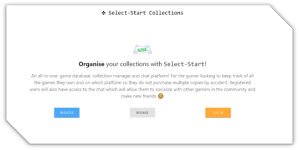
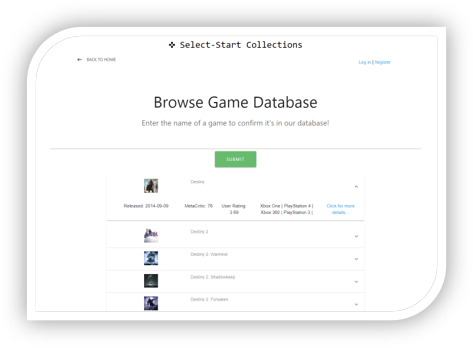
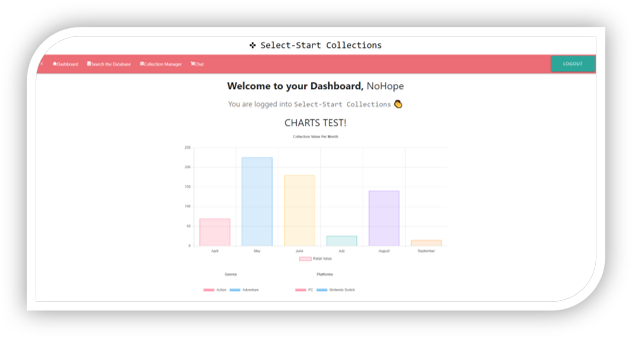
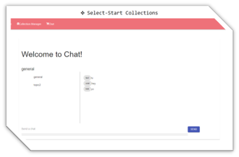

# 23-24 Project #3

## ⋘ ──── ∗⋅◦∘◈\[[Select-Start Collections](https://select-start-collections.herokuapp.com/)\]◈∘◦⋅∗ ──── ⋙

by [MissNG-Git](https://github.com/MissNG-Git)

_[Select-Start Collections](https://select-start-collections.herokuapp.com/)_ solo MERN-stack application that provides users a 'one-stop-shop' to browse a game database, manager their game collection and socialise on an intuitive chat platform.

Technologies utilized include...

- [MongoDB](https://www.mongodb.com/cloud/atlas1)
- [Express.js Framework](https://expressjs.com/)
- [React.js](https://reactjs.org/)
- [Node Environment](https://nodejs.org/)
- [Material-UI Framework](https://material-ui.com/)
- [Materialize CSS](https://materializecss.com/)
- [Passport](http://www.passportjs.org/) with...
- [JSON Web Tokens Package](https://www.npmjs.com/package/jsonwebtoken) and...
- [Bcryptjs Package](https://www.npmjs.com/package/bcryptjs)
- [Redux](https://redux.js.org/)
- [Chart.js](https://www.chartjs.org/)
- [Socket.io](https://socket.io/)
- [RAWG.io API](https://rawg.io/)
- [GitBash](https://gitforwindows.org/)
- [Heroku Platform](https://www.heroku.com/)

To view a copy of our Presentation, please **[CLICK HERE](https://drive.google.com/file/d/1SX0fRjXyh-2yob8YqI9chvvgaJUit4gm/view?usp=sharing)**!
_(available in .pdf & .pptx)_

## ≫ ──── ≪•◦ OBJECTIVES ◦•≫ ──── ≪

```
+ AS A Gamer
+ I WANT TO be able to log in to manage all the games in my collection and chat with others
+ SO THAT I can see what games I already own and make friends, all on the same platform

```

## ≫ ──── ≪•◦ MOCK-UP ◦•≫ ──── ≪

The following images show the web application's appearance & functionality:

<p float="left">
    
    
</p>
<p float="left">
  
    
</p>

### ≫ ──── ≪•◦ CODE FUNCTIONALITY ◦•≫ ──── ≪

- Application directs user to a landing page with the option to register an account, login or browse the database.

- Application successfully directs user to the account creation page when "Register" is selected and conversely to the login page when "Login is selected"

- Upon clicking submit on account creation, information entered into the form will update the back-end database. User will automatically be directed to the `Dashboard` upon successful register.

- Application allows user to log in if account has already been created and directs user to the `Dashboard`; will persist upon page refresh or closing and re-opening of webpage handled by JSON Web Tokens

- When directed to the `Dashboard`, a bar graph displays collection data for the the last few months via Chart.js, which can be managed via the `Collection Manager` page.

- When `Search the Database` is selected, user is directed to a search page similar to `Browse` where they will be able to search the RAWG.io database for a specific game (displayed in the form of an accordion).

- Upon selecting the option for 'more details' relating to a particular game, user will be directed to a more in-depth information page for the relative game, complete with screenshots, and will also present an `Add to Collection` button.

- When `Add to Collection` is clicked, the game data will be saved to the relative collection database in MongoDB.

- A user can also navigate to `Chat` which utilizes socket.io to allow them the ability to create new 'topic rooms' and socialize with like-minded individuals.

- Application has been successfully deployed to Heroku and can be visited [here](https://select-start-collections.herokuapp.com/)!

### ≫ ──── ≪•◦ USABILITY ◦•≫ ──── ≪

1. Navigate to deployed application page on [Heroku](https://select-start-collections.herokuapp.com/)
2. As an unregistered user, you can select "Browse" from the Landing page to search for games available in the database
3. If you are a new client, select "Register" from the Landing page to register your details into our database
4. If you are a returning client, select "Login" from the Landing page and enter your login details
5. Upon successful login / register, you'll be directed to the `Dashboard` where you can see visual representations of what is in your collection
6. Click on `Search the DB`to look for a specific game you'd like to add to your collection
7. When the desired game is found, "Click for more details" to navigate to the game details page where you can "Add to Collection"
8. Select `Collection Manager` in order to see a table of all the games currently added to your collection. Clicking on the "-" will remove the game from your collection
9. When you go to `Chat`, the chat area will allow you to select a desired topic or create a new topic then start chatting in that selected window
10. Click on log out to remove your 'session data' (JWT) and be directed back to the Login page

### ≫ ──── ≪•◦ FUTURE DEVELOPMENTS ◦•≫ ──── ≪

I hope to implement these fixed & additional features in the near future:

[Priority Fixes]

- Fix Chart.js data to dynamically generate
- Fix Collection Manager table to dynamically generate
- Option to remove games from collection
- Working Chat function & room creation

[Additional Features]

- Account Management to allow users to update personal details
- Allow user to add custom photo at account creation (to be displayed in sidebar)
- Improve search functionality, both for non/registered users
- Collection sorting capabilities to better organize games
- Ability to manage additional collections (i.e., movies, music, books, etc.)
- Capability to wish-list games / items and add to a ‘sell list’
- Exporting capabilities for collection data
- Blog page and/or
- Community forum
